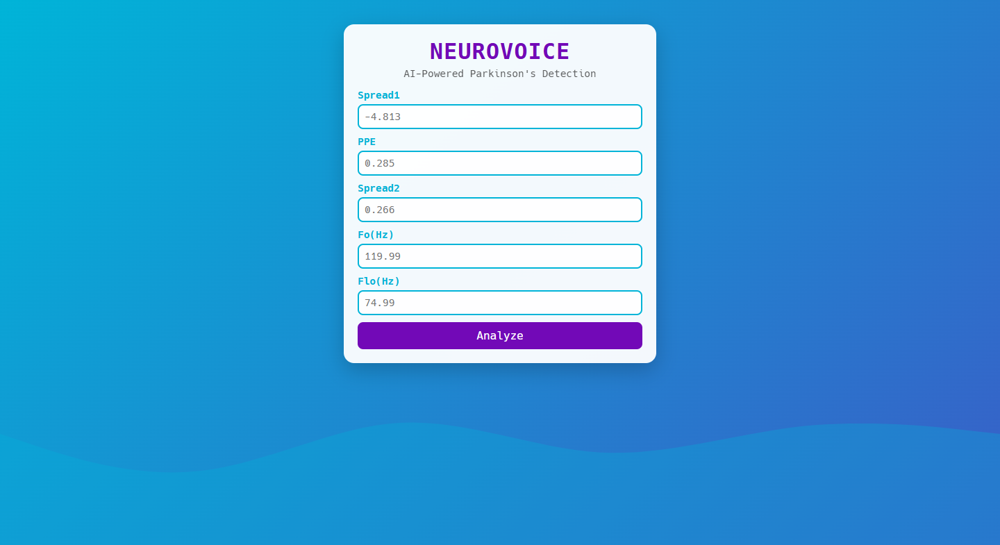
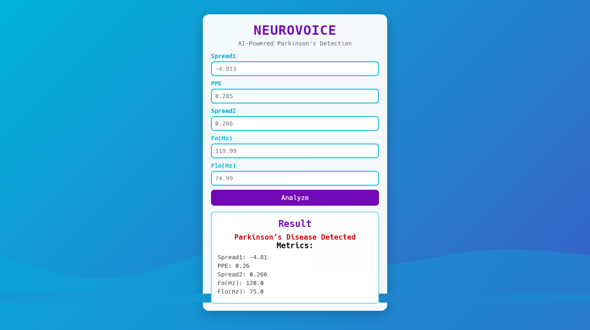

# NeuroVoice Predictor: Parkinson’s Disease Detection

Welcome to **NeuroVoice Predictor**, a FastAPI web application that leverages AI to predict Parkinson’s disease status using voice measurement data. Powered by a pre-trained machine learning model, this app provides a sleek, futuristic interface for inputting five key features (`spread1`, `PPE`, `spread2`, `MDVP:Fo(Hz)`, `MDVP:Flo(Hz)`) and receiving instant predictions.




## Table of Contents
- [Features](#features)
- [Screenshots](#screenshots)
- [Installation](#installation)
- [Usage](#usage)
- [Project Structure](#project-structure)
- [Dependencies](#dependencies)
- [Troubleshooting](#troubleshooting)
- [License](#license)

## Features
- **AI-Powered Prediction**: Uses a pre-trained `scikit-learn` model (`model.pkl`) to predict Parkinson’s disease status (0 = healthy, 1 = Parkinson’s).
- **Compact & Futuristic UI**: A responsive, medical-themed interface with animated gradients, glowing inputs, a pulsating predict button, and a waveform background.
- **FastAPI Backend**: Efficiently handles form submissions and renders dynamic HTML with Jinja2 templates.
- **Input Validation**: Ensures valid float inputs using Pydantic.
- **Visible Results**: Compact form and result section designed to fit within a 100% zoom viewport.

## Screenshots

### Home Page
The initial form for entering voice metrics, featuring a vibrant gradient and waveform animation.


### Positive Prediction
Result when Parkinson’s disease is detected, displayed in red with input values.


### Negative Prediction
Result when no Parkinson’s disease is detected, displayed in teal.


## Installation

1. **Clone the Repository**:
   ```
   git clone https://github.com/your-username/neurovoice-predictor.git
   cd neurovoice-predictor
   ```
2. **Set Up a Virtual Environment:**
```
python -m venv venv

```
3. **On Windows:**
```
.\venv\Scripts\Activate.ps1

```
4. **On macOS/Linux:**
```
source venv/bin/activate

```
5. **Install Dependencies:**
```
pip install fastapi uvicorn pandas scikit-learn jinja2 python-multipart
```
### Usage
- **Run the FastAPI App:**
```
uvicorn app:app --reload

```

## Project Structure

```
neurovoice-predictor/
├── images/
│   ├── home.png
│   ├── prediction_positive.png
│   └── prediction_negative.png
├── static/
│   └── style.css
├── templates/
│   └── index.html
├── model.pkl
└── app.py
```

- app.py: FastAPI backend with model loading and prediction endpoints.

- model.pkl: Pre-trained scikit-learn model.

- templates/index.html: Compact HTML form and result display.

- static/style.css: Futuristic CSS with animations and responsive design.

- images/: Screenshots for README display.

### Dependencies
- Python 3.7+
- fastapi
- uvicorn
- pandas
- scikit-learn
- jinja2
- python-multipart

### Install via:

```
pip install fastapi uvicorn pandas scikit-learn jinja2 python-multipart
```
